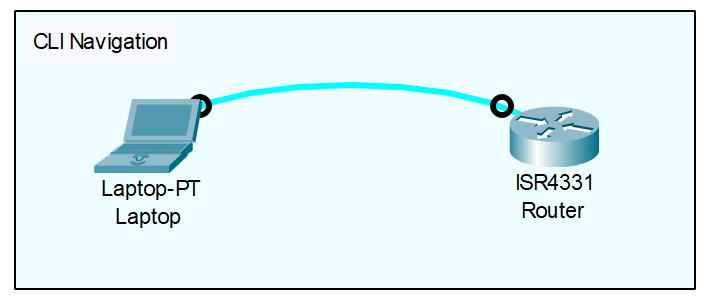

<div align="center">

# Cisco IOS CLI Navigation

</div>

## Overview
If you are new to Cisco networking or are migrating from other vendor equipment (like Juniper or standard Linux servers), the **Cisco Internetwork Operating System (IOS)** might feel a bit unusual at first. Cisco IOS is a proprietary, text-based operating system used to configure, monitor, and maintain Cisco routers and switches. Unlike standard operating systems where you can type any command from a single prompt, Cisco IOS uses a strict hierarchical mode structure. The commands you are allowed to execute depend entirely on which "mode" you are currently in. This structure acts as a built-in security and safety mechanism.

## Why it is important
While Graphical User Interfaces (GUIs) exist, the Command Line Interface (CLI) remains the undisputed standard for network engineers. It is significantly faster, highly scriptable for automation, and consumes minimal bandwidth—which is crucial when troubleshooting over slow, remote connections. Mastering CLI navigation, keyboard shortcuts, and the built-in help system is the absolute foundational skill required before learning any other routing or switching topic.

## Real-World Access: How Do We Connect?
In the real world, you cannot just click a "CLI" tab like you do in an emulator. We access routers in two main ways:
1. **Out-of-Band (Physical Access):** When a router is brand new out of the box, it has no IP address. Engineers use a physical **Console Cable** (often a distinct light blue cable) to connect their laptop's serial or USB port directly to the router's physical "Console" port. To view the CLI, you must use a **Terminal Emulator** program on your laptop. **PuTTY** is the most famous and widely used free terminal emulator in the industry. You open PuTTY, select a "Serial" connection, set the speed (usually 9600 baud), and the router's CLI appears on your screen.
2. **In-Band (Remote Access):** Once the router has been initially configured with an IP address and passwords, engineers connect to it remotely over the network. They use PuTTY (or similar software like SecureCRT) to establish a secure **SSH** connection to the router's **VTY (Virtual Teletype)** lines.

## Topology
<div align="center">



*(Note: A single ISR4331 router and a Laptop connected via a console cable in Cisco Packet Tracer are used to explore the command hierarchy and terminal settings.)*

</div>

## Requirements
* 1x Cisco IOS Router (ISR4331)
* 1x Laptop (Laptop-PT)
* A Console cable connecting the Laptop's RS-232 port to the Router's Console port
* App used: Cisco Packet Tracer

## The CLI Mode Hierarchy
The Cisco IOS is split into three main modes, with various sub-modes beneath them. Here is a visual representation of how they nest:

```text
User EXEC Mode (Router>)
      |
      |--- Privileged EXEC Mode (Router#)
                 |
                 |--- Global Configuration Mode (Router(config)#)
                            |
                            |--- Line Console (Router(config-line)#)
                            |
                            |--- Line VTY (Router(config-line)#)
```

1. **User EXEC Mode (`>`):** The default mode when you first log in. It is highly restricted. You can run basic tests like `ping`, but you cannot view the full configuration or change any settings.
2. **Privileged EXEC Mode (`#`):** Often called "Enable mode." This is the equivalent of "root" or "administrator" access. You can view all configurations, restart the device, and run advanced troubleshooting commands, but you cannot make configuration changes here.
3. **Global Configuration Mode (`(config)#`):** This is where you actually change the device's settings. Changes made here affect the entire device globally (e.g., setting the hostname).
4. **Sub-Configuration Modes:** From Global Configuration, you dive deeper into specific components to configure them, such as a specific terminal line (Console or VTY) or a physical interface.

## Step-by-Step Navigation Walkthrough

Let's walk through how to move up and down this hierarchy.

**Step 1: Moving Up to Privileged EXEC**
When you start, you are at `Router>`. To gain full viewing rights, type `enable`.
```text
Router> enable
Router#
```

**Step 2: Entering Global Configuration**
To make changes to the device, you must move from Privileged EXEC into Global Configuration mode using the `configure terminal` command.
```text
Router# configure terminal
Router(config)#
```

**Step 3: Entering Sub-Modes**
Once in Global Configuration, you can target specific parts of the router. 
* To configure the physical console port:
  ```text
  Router(config)# line console 0
  Router(config-line)#
  ```
* To configure the remote access ports (for SSH/Telnet):
  ```text
  Router(config)# line vty 0 4
  Router(config-line)#
  ```

**Step 4: Moving Backwards (`exit`, `end`, and `disable`)**
You have three different commands to step backward out of the hierarchy:
* `exit`: Moves you exactly **one level back**. If you are in `(config-line)#`, typing `exit` puts you back in `(config)#`.
* `end`: Immediately drops you out of *any* configuration mode straight back to **Privileged EXEC mode (`Router#`)**. This is much faster than typing `exit` multiple times.
* `disable`: Takes you from Privileged EXEC (`Router#`) down to **User EXEC (`Router>`)**, safely dropping your administrative privileges if you are walking away from your desk.

**Step 5: The Magic of `do`**
By default, you cannot run verification commands (like `show ip interface brief`) while inside a configuration mode. The router will reject it. However, if you prefix your command with the word `do`, the router will execute the Privileged EXEC command without forcing you to back out of your current mode.
```text
Router(config-line)# do show privilege
```

## Quality of Life Settings
When configuring a fresh router via the console cable, engineers immediately apply three specific settings to the Line modes to make their workflow smoother:

1. **`logging synchronous`**: By default, if the router generates a system alert (like an interface changing state), it will print the message right in the middle of whatever command you are currently typing, visually tearing your text in half. Applying `logging synchronous` forces the router to drop your partially typed command to a fresh line after the alert, keeping it perfectly intact.
2. **`exec-timeout`**: This sets the idle timer. If you stop typing, the router will log you out after a set time. Setting it to `exec-timeout 0 0` completely disables the timeout (great for lab environments, but terrible for production security).
3. **`history size`**: The router remembers your most recently typed commands. The default buffer is very small (10 commands). You can increase this by typing `history size 100` so the terminal remembers your last 100 commands.

## Essential CLI Shortcuts and Tricks
Working fast in the CLI means rarely typing full words and keeping your hands on the keyboard.

**Context-Sensitive Help:**
* **The Question Mark (`?`):** If you don't know what commands are available in your current mode, type `?` and press enter. If you know a command starts with "c" but forget the rest, type `c?` (no space). If you typed a command but don't know what parameter comes next, type a space and then `?` (e.g., `clock set ?`).
* **Tab Completion:** Never type full commands. Type the first few unique letters and hit the `Tab` key. The router will auto-complete the word for you. For example, type `conf` + `Tab` and it instantly expands to `configure`.

**Arrow Keys:**
* **Up / Down Arrows:** Cycles backward and forward through your command history. If you make a typo in a massive configuration string, do not retype it! Press the Up arrow to recall the bad command, fix the typo, and hit Enter.
* **Left / Right Arrows:** Moves your cursor back and forth along the current line without deleting characters, allowing you to quickly insert missing letters.

**Keyboard Hotkeys:**
* **`Ctrl + A`**: Instantly jumps your cursor to the very beginning of the line.
* **`Ctrl + E`**: Instantly jumps your cursor to the very end of the line.
* **`Ctrl + W`**: Deletes a single word to the left of your cursor (much faster than holding the Backspace key).
* **`Ctrl + U`**: Erases the entire line you are currently typing, giving you a fresh start.

**Breaking and Interrupting Processes:**
* **`Ctrl + C`**: If you are trapped in a setup wizard or a long, scrolling output screen, this forcefully aborts the current process and returns you to the prompt.
* **`Ctrl + Shift + 6` (Break Sequence):** If you make a typo in User EXEC mode (e.g., typing `enabl` instead of `enable`), the router thinks you are trying to Telnet to a device named "enabl". It will freeze your terminal with a `Translating "enabl"... domain server` message for several minutes. Pressing `Ctrl + Shift + 6` instantly aborts this frustrating DNS lookup.

## Common Mistakes
* **Confusing `exit` and `end`:** Using `exit` multiple times to back out of a deeply nested sub-mode when a single `end` command would return you to the `Router#` prompt instantly. Alternatively, typing `exit` from Privileged EXEC mode will completely drop your console connection.
* **Forgetting the `do` keyword:** Attempting to run a verification command like `show ip interface brief` while in Global Configuration mode without the `do` prefix will result in an `% Invalid input detected` error.

## Troubleshooting
* **`% Invalid input detected at '^' marker:`** The caret (`^`) points to exactly where the CLI got confused. Back up to that point using your Left arrow key and press `?` to see what is actually valid there.
* **`% Ambiguous command:`** You didn't type enough letters for the router to know which command you meant (e.g., typing `c` instead of `co` for `configure`). Type a few more letters.
* **`% Incomplete command:`** You are missing a required parameter. Press the Up arrow to recall the command, add a space, and press `?` to see what the router expects next.

## Best Practices
* **Always apply `logging synchronous`:** You should apply this to the console and VTY lines on every single device you configure. It heavily reduces input errors and frustration.
* **Enforce strict VTY timeouts:** While `exec-timeout 0 0` is great for Packet Tracer, you must configure a reasonable idle timeout (e.g., `exec-timeout 5 0` for 5 minutes) on VTY lines in production environments so abandoned remote sessions cannot be hijacked.
* **Use SSH over Telnet:** For remote management on VTY lines, always secure your connections using SSH. Telnet sends all traffic (including your login passwords) in plain text, which can be easily intercepted.

## References
* [Cisco IOS Configuration Fundamentals Command Reference](https://www.cisco.com/c/en/us/td/docs/ios/fundamentals/command/reference/cf_book.html)
* [Download PuTTY - Free SSH and Telnet Client](https://putty.org/index.html)
