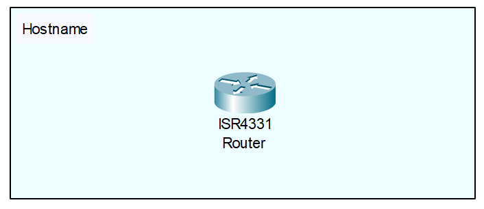

<div align="center">

# Cisco IOS Hostname Configuration

</div>

## Overview
The hostname is the primary administrative identifier for a Cisco network device. By default, every Cisco router is named `Router` and every switch is named `Switch`. Configuring a unique hostname is the very first step in provisioning a new device, as it changes the command-line prompt to reflect the device's specific identity. 

## Why it is important
In an enterprise network containing dozens or hundreds of devices, leaving the default hostname makes remote management exceptionally dangerous. If multiple terminal windows all display the `Router#` prompt, an engineer could easily deploy a configuration to the wrong device, potentially causing a major network outage. Furthermore, a uniquely configured hostname is a hard prerequisite for generating cryptographic keys (such as the RSA keys required for securing remote access with SSH).

## Topology
<div align="center">
  


*(Note: A single, unconfigured Cisco router is all that is required for this topic. No cabling or adjacent devices are necessary.)*

</div>

## Requirements
* 1x Cisco IOS Router (e.g., ISR4331)
* Console or CLI access
* App used: Cisco Packet Tracer (or any standard emulator like GNS3/EVE-NG)

## Configuration

```text
! R1 Hostname Configuration
enable
configure terminal

! Apply the new hostname
hostname NYC-CORE-R1

! Notice that the prompt immediately changes from Router(config)# to NYC-CORE-R1(config)#
```

## Configuration Explanation
* `hostname [name]` - This command modifies the device's system name. As soon as you press Enter, the CLI prompt dynamically updates to display the new name, providing immediate visual feedback of the change.
* **Naming Rules:** A valid Cisco IOS hostname must start with a letter, end with a letter or digit, and contain only letters, digits, and hyphens. It cannot contain spaces.

## Verification

```text
NYC-CORE-R1# show running-config | include hostname
```
* **Visual Verification:** The most obvious way to verify the configuration is simply looking at your CLI prompt. It should now read `NYC-CORE-R1#` instead of `Router#`.
* **`show running-config | include hostname`:** This command filters the active configuration file to specifically display the line where the hostname is defined. The output should return exactly `hostname NYC-CORE-R1`.

## Common Mistakes
* **Including Spaces:** Attempting to name a router `NYC CORE R1` will result in an `% Invalid input detected` error. If you need visual separation in your names, you must use hyphens (`-`) or underscores (`_`), though hyphens are the industry standard.
* **Starting with a Number:** While newer IOS versions might accept it, starting a hostname with a number violates traditional RFC guidelines for hostnames and can cause DNS resolution issues or command rejections on older equipment.

## Troubleshooting
1. **Command is rejected:** If the router returns an error when typing the `hostname` command, verify that you are in Global Configuration mode (`Router(config)#`). You cannot change the hostname from Privileged EXEC mode (`Router#`).
2. **Name reverts after a reboot:** If the hostname drops back to `Router` after reloading the device, you forgot to save your configuration. Always run `copy running-config startup-config` after making administrative changes.

## Best Practices
* **Use a standardized naming convention:** Never name routers arbitrarily (e.g., "Bob-Router"). Enterprise environments use strict naming standards that usually define the physical location, the device role, and the device number (e.g., `[SiteCode]-[Role]-[ID]`). For example, `LON-EDGE-R02` instantly tells an engineer they are logged into the second Edge Router in the London office.
* **Configure it immediately:** Make changing the hostname the absolute first command you type when provisioning a new box. This prevents any identity confusion before you start pasting in complex configurations.

## References
* [Cisco IOS Command Reference](https://www.cisco.com/c/en/us/td/docs/ios/fundamentals/command/reference/cf_book/cf_f1.html#wp1026065)
