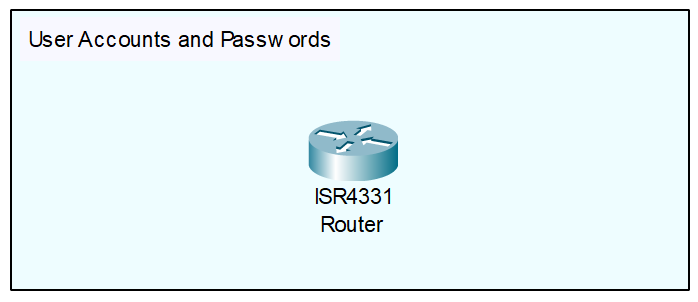

<div align="center">

# Cisco IOS User Accounts and Passwords

</div>

## Overview
Cisco IOS allows you to create local user accounts directly on the device's internal database. Instead of relying on a single, globally shared password for access, you can define individual usernames paired with secure passwords and specific privilege levels. This ensures that every person logging into the router or switch has their own unique credentials and appropriate access rights.

## Why it is important
In a production enterprise network, accountability and security are paramount. If an entire team of ten engineers shares a single console or `enable` password, you have no auditing trail to determine *who* made a critical configuration change that caused a network outage. 

While large enterprises ultimately scale their security using centralized authentication servers like RADIUS and TACACS+, setting up local user accounts is the crucial first step. Furthermore, a local administrator account is a mandatory best practice; it serves as your "break-glass" fallback account if the router ever loses connectivity to the centralized authentication servers.

## Topology

<div align="center">



*(Note: The lab environment consists of a single, standalone Cisco ISR4331 Router. No additional network connections are required to configure and test local user databases.)*

</div>

## Requirements
* **Lab Application:** Cisco Packet Tracer (or EVE-NG / GNS3)
* **Devices:** One Cisco IOS router (ISR4331)
* **Connectivity:** Basic terminal/console access to the CLI

## Configuration

```text
! Router Configuration
enable
configure terminal

! 1. Enable global password encryption for legacy plaintext passwords
service password-encryption

! 2. Create a basic user account (defaults to privilege level 1)
username helpdesk secret SecurePass123!

! 3. Create an administrative user account with full access (privilege level 15)
username netadmin privilege 15 secret AdminPass456!

! 4. Apply local database authentication to the physical Console line
line con 0
 login local
 exit

! 5. Apply local database authentication to the Virtual Terminal (VTY / Remote) lines
line vty 0 4
 login local
 exit
```

## Configuration Explanation
* `service password-encryption` - Encrypts all plaintext passwords currently residing in the configuration file using a weak Type 7 encryption. While not highly secure against cracking tools, it effectively prevents "shoulder surfing" if a colleague looks at your screen while you view the running configuration.
* `username [name] secret [password]` - Creates a local user account. Using the keyword `secret` (instead of `password`) forces the router to hash the password securely (using MD5, SHA-256, or scrypt depending on IOS version), making it highly resistant to reverse-engineering.
* `privilege 15` - Assigns the highest administrative privilege level to the user. When `netadmin` logs in, they will bypass standard User EXEC mode (`Router>`) and drop directly into Privileged EXEC mode (`Router#`).
* `line con 0` - Enters the configuration mode for the physical console port (used when connected via a console cable).
* `line vty 0 4` - Enters the configuration mode for the first five virtual terminal lines, which handle remote access protocols like SSH and Telnet.
* `login local` - Instructs the router to check the local username database for credentials when someone attempts to log in, overriding the default behavior of asking for a simple, shared line password.

## Verification

```text
Router# show running-config | include username
```
Look for the username entries. You should see a number (like `5`, `8`, or `9`) after the word `secret` followed by a random string of characters. This confirms your passwords are securely hashed (e.g., `username netadmin privilege 15 secret 5 $1$mERr$abc123XYZ...`).

```text
Router# show users
```
This command displays the currently active sessions. You can verify that you are logged in using the specific username you just created under the "User" column.

## Common Mistakes
* **Using `password` instead of `secret`:** If you type `username admin password cisco`, the password is saved in cleartext. Even if you use `service password-encryption`, it only applies trivial Type 7 encryption, which can be instantly decrypted using free online tools. Always use the `secret` keyword.
* **Locking yourself out:** If you configure `login local` on `line con 0` or `line vty 0 4` *before* you actually create a local username, the router will immediately start prompting for credentials you haven't created yet, completely locking you out of the device upon your next login.

## Troubleshooting
1. **Test before you disconnect:** Whenever you configure authentication, open a *second* SSH session or console tab to test your new credentials while leaving your original administrative session active. If the new credentials fail, you can fix the issue using the original, still-active session.
2. **Check line configurations:** If the router is not prompting for a username and only asks for a password, verify that `login local` is explicitly applied to the specific line by running `show run | section line`. If it simply says `login`, it is looking for a line password, not a local database user.

## Best Practices
* **Never share accounts:** "Admin1" or "NetworkTeam" are bad usernames. Use "JSmith" or "ADoe". Every log entry, syslog message, and configuration change must be tied to a specific human for accountability.
* **Always define a local fallback admin:** Even if your enterprise uses centralized TACACS+ or RADIUS servers, always configure a local `netadmin` account. If the router loses connectivity to the AAA servers, this local account ensures you aren't permanently locked out.
* **Implement Privilege Levels:** Follow the principle of least privilege.
  ```text
  +---------------------------------------------------+
  | Privilege Level 15 (Full Access / Root)           |
  |  - Can execute any command, view all configs      |
  +---------------------------------------------------+
  | Privilege Level 2-14 (Custom/Role-Based)          |
  |  - Tailored access (requires extra custom config) |
  +---------------------------------------------------+
  | Privilege Level 1 (User EXEC / Default)           |
  |  - Basic ping, show commands, limited access      |
  +---------------------------------------------------+
  | Privilege Level 0 (Minimal)                       |
  |  - Only logout, enable, disable, and help         |
  +---------------------------------------------------+
  ```
  Give junior engineers or helpdesk staff Privilege Level 1. Reserve Privilege Level 15 strictly for senior network engineers making topology-changing modifications.

## References
* [Cisco IOS Security Command Reference: username](https://www.cisco.com/c/en/us/td/docs/ios-xml/ios/security/s1/sec-s1-cr-book/sec-cr-t2.html#wp4102283080)
