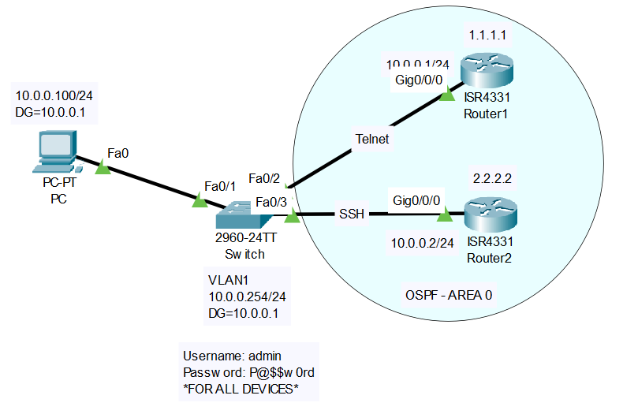

<div align = "center">

# Cisco IOS VTY, Telnet & SSH

</div>

## Overview
When you first configure a Cisco device, you must connect directly to it using a physical console cable. However, once the device is configured with an IP address and connected to the network, you can manage it remotely over the network. This remote access is handled by **VTY (Virtual Teletype)** lines. VTY lines act as logical interfaces that listen for inbound management traffic. 

There are two primary protocols used to connect to these VTY lines:
*   **Telnet:** An older protocol that sends all data—including your username and password—in plain text. 
*   **SSH (Secure Shell):** A modern protocol that encrypts all traffic between your computer and the network device, ensuring your credentials and configurations remain secure.

## Why it is important
In a real-world enterprise environment, network engineers do not walk into a freezing cold data center or fly to a remote branch office every time a switch needs a configuration change. They manage hundreds or thousands of devices right from their desks using the management network. Configuring VTY lines with SSH is a fundamental requirement for every device on an enterprise network, allowing engineers to securely log in, monitor, and configure equipment from anywhere.

## Topology

<div align = "center">



*This lab consists of a management PC connected through a Layer 2 switch to two routers (R1 and R2). The network has full reachability via OSPF. We will configure R1 to accept legacy Telnet connections, and R2 to accept secure SSH connections.*

</div>

## Requirements
*   Lab Application: Cisco Packet Tracer
*   Basic IP connectivity between all devices (OSPF Area 0 is pre-configured).
*   A local user account configured on the devices (`admin` with password `P@$$w0rd` is pre-configured).

## Configuration

```text
! ------------------------------------------------
! Router 1 (R1) - Configuring Legacy Telnet
! ------------------------------------------------
enable
configure terminal

! 1. Enter the VTY line configuration mode (lines 0 through 4)
line vty 0 4

! 2. Instruct the device to use the local username database for authentication
login local

! 3. Restrict inbound connections to ONLY Telnet
transport input telnet
exit


! ------------------------------------------------
! Router 2 (R2) - Configuring Secure SSH
! ------------------------------------------------
enable
configure terminal

! 1. Define a domain name (Required for generating RSA crypto keys)
ip domain-name coie.local

! 2. Generate the RSA encryption keys
! When prompted, enter a modulus size (1024 or 2048 are standard)
crypto key generate rsa
! (Example Prompt): How many bits in the modulus [512]: 2048

! 3. Force the device to use SSH Version 2
ip ssh version 2

! 4. Enter the VTY line configuration mode
line vty 0 4

! 5. Instruct the device to use the local username database
login local

! 6. Restrict inbound connections to ONLY SSH
transport input ssh
exit
```

## Configuration Explanation
To understand remote access, it helps to visualize how connections enter the device:

```text
+---------------------------------------------------+
|                  Cisco Router/Switch              |
|                                                   |
| [Console Port] <--- Physical Cable (1 Connection) |
|                                                   |
| [VTY 0] <-\                                       |
| [VTY 1] <--\        Logical / Virtual Ports       |
| [VTY 2] <---+------ (Listen for SSH / Telnet)     |
| [VTY 3] <--/                                      |
| [VTY 4] <-/                                       |
+---------------------------------------------------+
```

*   `line vty 0 4` - Cisco devices use numbers to track concurrent virtual connections. `0 4` means we are configuring lines 0, 1, 2, 3, and 4 simultaneously (allowing up to 5 administrators to be logged in at the exact same time).
*   `login local` - By default, VTY lines either require no password or a single shared password. `login local` tells the router: *"When someone connects, ask them for a username and password, and check it against the local database."*
*   `transport input [protocol]` - This acts as a security gatekeeper for the VTY lines. If you set it to `ssh`, the router will completely drop Telnet attempts. 
*   `ip domain-name` & `crypto key generate rsa` - SSH relies on mathematical encryption keys to secure the session. A Cisco router combines its hostname and its domain name (e.g., `R2.coie.local`) to generate this unique RSA key pair. 
*   `ip ssh version 2` - Forces the router to use the newer, much more secure version of the SSH protocol. SSH version 1 has known security vulnerabilities and should be strictly avoided in production.

## Verification
To verify your configuration, we will act as the network administrator and test connectivity from the **PC**.

### 1. Test Telnet to R1
Open the Command Prompt on the PC and Telnet to R1's Loopback IP (1.1.1.1):
```text
C:\> telnet 1.1.1.1
Trying 1.1.1.1 ...Open

User Access Verification
Username: admin
Password: 
R1>
```

### 2. Test SSH to R2
Open the Command Prompt on the PC and SSH to R2's Loopback IP (2.2.2.2). We must specify the username using the `-l` flag (lowercase L):
```text
C:\> ssh -l admin 2.2.2.2
Password: 
R2>
```

### 3. View Active Sessions
Once logged into R2, you can verify who is currently connected to the device using the `show users` command:
```text
R2# show users
    Line       User       Host(s)              Idle       Location
*  2 vty 0     admin      idle                 00:00:00   10.0.0.100
```
*   **Line:** Shows they are connected to `vty 0`. The asterisk `*` indicates this is your current session.
*   **Location:** Shows the IP address of the PC (`10.0.0.100`) that initiated the connection.

## Common Mistakes
*   **Locking Yourself Out:** If you type `login local` on the VTY lines but forget to actually create a user with the `username ... secret ...` command globally, the router will deny all logins because the database is empty.
*   **Forgetting to generate crypto keys:** If you configure `transport input ssh` but forget to run `crypto key generate rsa`, the SSH protocol will not start, and the router will refuse the connection.
*   **Using `transport input all`:** This is the default on older IOS versions. It allows both Telnet and SSH, meaning a misconfigured client could unknowingly send their password in plaintext.

## Troubleshooting
1.  **Check Network Reachability:** If your SSH/Telnet connection times out, ensure the PC can actually reach the router. Run `ping 1.1.1.1` or `ping 2.2.2.2` from the PC. If the ping fails, you have a routing or IP configuration issue, not a VTY issue.
2.  **Verify VTY Settings:** From the console, run `show run | section vty` to verify that `login local` and the correct `transport input` protocols are configured.
3.  **Check SSH Status:** Run `show ip ssh` on the router. If it says "SSH Disabled", you likely forgot to generate the RSA keys or give the router a hostname/domain-name.

## Best Practices
*   **Always use SSH, never Telnet.** Telnet sends everything in cleartext. Anyone running a packet capture (like Wireshark) on your network can instantly read your admin passwords and everything you type. Always enforce `transport input ssh`.
*   **Force SSH Version 2:** Always explicitly define `ip ssh version 2` to prevent fallback to the vulnerable version 1.
*   **Configure an Exec Timeout:** By default, if you walk away from your desk, the SSH session stays open indefinitely. Configure an idle timeout (e.g., `exec-timeout 5 0` for 5 minutes and 0 seconds) under the `line vty` configuration to automatically log out idle users.
*   **Restrict Access with Access Lists:** In enterprise environments, use an `access-class` command on the VTY lines to restrict SSH access so that connections are only accepted from authorized management IP subnets.

## References
*If you are unfamiliar with the underlying concepts of these protocols (like RSA cryptography, how SSH or Telnet fundamentally work, or DNS domain names), you can use the resources below to learn more:*

*   **SSH & Telnet Concepts:**
    *   [Cisco IOS Security Configuration Guide: Secure Shell (SSH)](https://www.cisco.com/c/en/us/support/docs/security-vpn/secure-shell-ssh/4145-ssh.html)
    *   [RFC 4251: The Secure Shell (SSH) Protocol Architecture](https://datatracker.ietf.org/doc/html/rfc4251)
    *   [RFC 854: Telnet Protocol Specification](https://datatracker.ietf.org/doc/html/rfc854)
*   **Cryptography & Domain Names:**
    *   [Cloudflare: What is DNS?](https://www.cloudflare.com/learning/dns/what-is-dns/))
    *   [Wikipedia: RSA cryptosystem](https://en.wikipedia.org/wiki/RSA_cryptosystem))
