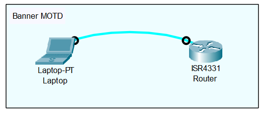

<div align = "center">

# 05-Banner-MOTD

</div>

## Overview
A banner is a configurable block of text that a Cisco IOS device displays to users when they connect via Console, Telnet, or SSH. While the Message of the Day (MOTD) banner is the most common, Cisco IOS also supports other types of banners, such as the Login banner and the EXEC banner, which appear at different stages of the authentication process. This fundamental administrative feature falls under the Device Basics progression.

## Why it is important
In enterprise environments, banners are critical for legal protection and compliance. A warning banner explicitly states that access is restricted to authorized personnel, preventing malicious actors from claiming they didn't know the system was private. Additionally, different banner types allow network engineers to provide specific instructions (like a Login banner detailing authentication steps) or system status updates (like an EXEC banner alerting a successfully authenticated admin about upcoming maintenance). 

## Topology

<div align = "center">


*(Note: The lab topology consists of a single management PC directly connected to the console port of Cisco IOS Router R1.)*

</div>

## Requirements
* One Cisco IOS router (R1).
* A simulated management PC with console access to the router.
* **App Declaration:** EVE-NG, GNS3, or physical hardware is strongly recommended for this lab.
> *"Packet Tracer supports the `banner motd` and `banner login` commands, but `banner exec` and other advanced banner types are not available."*
* **Starting State:** Because this is a basic introductory topic, the device configuration in the provided lab file is completely blank.

## Configuration

```text
! R1 Configuration
enable
configure terminal

! 1. Set the MOTD banner (Displays first, to all connections)
banner motd #
*****************************************************************
*                           WARNING                             *
*  UNAUTHORIZED ACCESS TO THIS NETWORK DEVICE IS STRICTLY       *
*  PROHIBITED. VIOLATORS WILL BE PROSECUTED.                    *
*****************************************************************
#

! 2. Set the Login banner (Displays after MOTD, before password prompt)
banner login #
Please use your standard Active Directory credentials to log in.
#

! 3. Set the EXEC banner (Displays ONLY after successful login "NOT AVAILABLE IN CISCO PACKET TRACER")
banner exec #
Maintenance Notice: This router will be rebooted on Friday at 2 AM.
#
```

## Configuration Explanation
* `banner motd #` - Creates the Message of the Day banner. This displays to absolutely anyone who connects to the device, before they even see a prompt. The `#` acts as a **delimiting character**, telling the router to record everything until it sees another `#`.
* `banner login #` - Creates a Login banner. This text is displayed immediately after the MOTD banner, but before the actual username/password prompts. It is typically used for authentication instructions. 
* `banner exec #` - Creates an EXEC (Execution) banner. Unlike the other two, this banner is *hidden* from unauthorized users. It only displays *after* a user successfully inputs the correct password and gains access to the CLI.
* `#` - The closing delimiter that signals the end of the banner configuration for each block.

## Verification

```text
R1# exit
```
*(Press Enter to spawn a new console prompt)*

```text
*****************************************************************
*                           WARNING                             *
*  UNAUTHORIZED ACCESS TO THIS NETWORK DEVICE IS STRICTLY       *
*  PROHIBITED. VIOLATORS WILL BE PROSECUTED.                    *
*****************************************************************
Please use your standard Active Directory credentials to log in.

User Access Verification

Password: [Enter Password]

Maintenance Notice: This router will be rebooted on Friday at 2 AM.
R1>
```
To confirm the configuration, exit Privileged EXEC mode entirely or open a new SSH/Console session. You will see the MOTD and Login banners immediately. After typing the password and successfully logging in, the EXEC banner will appear. You can also verify the configurations by running `show running-config | include banner`.

## Common Mistakes
* **Mistake 1: Testing advanced banners in Packet Tracer.** As mentioned, users often get frustrated when `banner exec` doesn't work in Packet Tracer. It is a limitation of the simulator, not your syntax. 
* **Mistake 2: Using the delimiting character inside the message.** If you use `#` as your delimiter, and then type `# Authorized Personnel #` inside your message, the router will instantly stop recording the banner at the first `#` it sees. Choose a delimiter you won't type in your message (like `^` or `&`).
* **Mistake 3: Making the MOTD banner friendly.** Writing "Welcome to the Core Router" is a security misstep. It implies an invitation, which can be used as a defense by attackers. 

## Troubleshooting
1. **Check if the banner is configured:** Run `show running-config | section banner`. If nothing is returned, the banner was not saved or applied correctly.
2. **Check the order of appearance:** Remember the strict order: `MOTD` -> `Login` -> (Authentication) -> `EXEC`. If a message isn't showing up when you expect it, ensure you didn't accidentally put EXEC text inside the MOTD block.
3. **Check formatting:** If the banner looks broken or misaligned, re-apply the command. Trailing spaces or missing spaces before the closing delimiter can throw off the visual layout.

## Best Practices
* **Keep it strictly legal:** Always use terms like "Unauthorized Access Prohibited" in the MOTD. 
* **Protect sensitive info:** Never include the hostname, OS version, or specific location in the MOTD or Login banners. Only place sensitive operational details (like maintenance windows) in the EXEC banner, which requires authentication to view.
* **Standardize across the enterprise:** Use a single, approved legal banner text for every device in your organization.

## References
* [Cisco IOS Configuration Fundamentals Command Reference - Banners](https://www.cisco.com/c/en/us/td/docs/ios/fundamentals/command/reference/cf_book/cf_a1.html)
