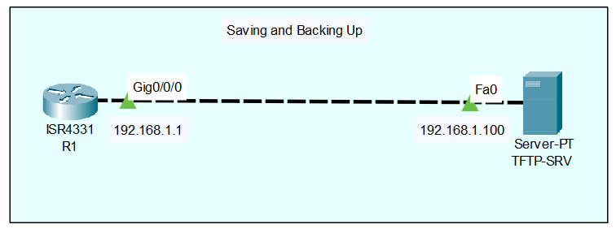

<div align = "center">

# 06-Saving-and-Backing-Up

</div>

## Overview
In Cisco IOS, the device's active, currently running configuration is stored in volatile RAM and is known as the `running-config`. If the device loses power or reboots, anything in RAM is instantly erased. To make configurations permanent, they must be saved to non-volatile RAM (NVRAM) as the `startup-config`. Furthermore, backing up this configuration to an external server ensures you can quickly restore your network if the physical router or switch suffers a hardware failure.
## Why it is important
In a production enterprise environment, forgetting to save your configuration is a painful rite of passage that usually ends in an unexpected network outage after a power flicker. Backing up configurations off-device is equally critical; hardware eventually fails. When a core switch dies at 2:00 AM, having a secure, centralized backup of the configuration is the difference between a 15-minute hardware swap and a multi-day network rebuild.

## Topology

<div align = "center">



```text
  [ R1 ] (Gi0/0) --------------------- (Eth0) [ TFTP Server ]
 192.168.1.1                                  192.168.1.100
```
**Topology Description:** A single Cisco IOS Router (R1) connected directly via GigabitEthernet0/0 to an external TFTP Server. Basic IP connectivity is already established between the two devices.

</div>

## Requirements
* One Cisco IOS router (R1).
* One server acting as a TFTP Server.
* Basic IP connectivity (ping success) between R1 and the TFTP Server.
* Application: Cisco Packet Tracer.

## Configuration

```text
! R1 Configuration
enable

! 1. Saving the active configuration to the device's NVRAM
copy running-config startup-config
! (Alternatively, you can use the legacy command: write memory)

! 2. Backing up the configuration to an external TFTP server
copy running-config tftp:
! The router will prompt you for the following details:
! Address or name of remote host []? 192.168.1.100
! Destination filename [r1-confg]? R1-Backup-2026.cfg
```

## Configuration Explanation
* `copy running-config startup-config` - This command copies the active configuration (currently running in RAM) and saves it permanently to NVRAM. The next time the device reboots, it will load this exact configuration.
* `write memory` - This is an older, legacy command that does the exact same thing as `copy running-config startup-config`. It is widely used by network engineers because it can be shortened to `wr`, saving keystrokes.
* `copy running-config tftp:` - This initiates a transfer of the active configuration to an external Trivial File Transfer Protocol (TFTP) server. You must provide the IP address of the server and the desired filename when prompted by the IOS interactive dialogue.

## Verification

```text
! Verify the startup configuration exists and matches the running config
R1# show startup-config

! Verify the file is physically stored in NVRAM
R1# dir nvram:
```
* **`show startup-config`**: Displays the saved configuration. If the output says "startup-config is not present", you have not saved your configuration.
* **`dir nvram:`**: Lists the files in NVRAM. Look for a file named `startup-config` and note its file size to ensure it isn't empty. 
* To verify the TFTP backup, check the file directory on your actual TFTP server software to confirm `R1-Backup-2026.cfg` was successfully received.

## Common Mistakes
* **Forgetting to save before a reboot:** Engineers often make changes, verify they work, and move on. If the device reboots weeks later, those unsaved changes vanish. Always run `write memory` after validating your changes.
* **Confusing Source and Destination:** The `copy` command syntax is always `copy [source] [destination]`. A catastrophic mistake is typing `copy startup-config running-config` when you meant to save, which will immediately overwrite your active changes with the old, saved config!
* **TFTP Firewalls:** TFTP uses UDP port 69. Often, the host firewall (like Windows Defender) on the TFTP server will block this traffic, causing the router's backup attempt to time out.

## Troubleshooting
1. **Step 1: Check basic connectivity.** If your TFTP backup fails, verify you can reach the server by running `ping 192.168.1.100`. If the ping fails, routing or interface IP configurations are incorrect.
2. **Step 2: Check server permissions.** Ensure the TFTP server application is actively running, unblocked by firewalls, and has write permissions to its target directory.
3. **Step 3: Verify NVRAM space.** If `copy run start` fails, run `dir nvram:` to ensure the NVRAM isn't completely full or experiencing corruption.

## Best Practices
* **Use the Archive Feature:** Modern enterprise routers should be configured using the `archive` command suite, which automatically backs up the configuration to a remote server every time a `write memory` is executed.
* **Avoid TFTP in Production:** TFTP is unencrypted and sends your configuration (which contains sensitive network designs, SNMP strings, and password hashes) in cleartext. In a real enterprise, always use SCP (Secure Copy Protocol) or SFTP instead of TFTP.
* **Version Control:** When manually naming backup files, always append the date or ticket number (e.g., `R1-Config-Aug3-2026.txt`) to maintain a clear, auditable history of changes.

## References
* Cisco IOS Configuration Fundamentals Command Reference: [copy command](https://www.cisco.com/c/en/us/td/docs/ios/fundamentals/command/reference/cf_book/cf_c1.html)
* RFC 1350 - The TFTP Protocol: [https://datatracker.ietf.org/doc/html/rfc1350](https://datatracker.ietf.org/doc/html/rfc1350)
