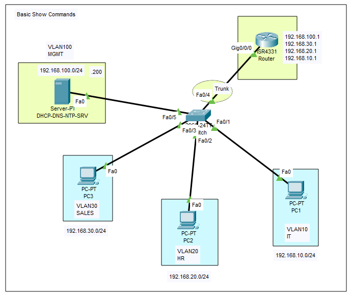

<div align="center">

# Cisco IOS Basic Show Commands

</div>

## Overview
In Cisco IOS, `show` commands are essential diagnostic tools used to view the current operational state, running configurations, and hardware statistics of a network device. While configuration commands build the network, `show` commands are how engineers verify those configurations are actively working and identify problems when they are not. This aligns perfectly with the goal of this comprehensive guide: moving beyond raw config dumps to understand what the technology does and how to verify it yourself.

## Why it is important
In a real-world enterprise environment, network engineers spend roughly 10% of their time configuring devices and 90% of their time monitoring, verifying, and troubleshooting them. Mastering `show` commands—and knowing exactly where to look within their outputs—is the most critical skill for identifying routing loops, downed links, or misconfigured interfaces without causing further network disruption. 

## Topology
<div align="center">



**Topology Description:**
This logical setup features a classic "Router-on-a-Stick" enterprise architecture. A Cisco ISR4331 Router connects to a centralized switch via an 802.1Q trunk. The switch segregates traffic into four distinct VLANs: IT (VLAN 10), HR (VLAN 20), SALES (VLAN 30), and MGMT (VLAN 100) with their respective subnets. 

</div>

## Requirements
* One pre-configured Cisco IOS Router (ISR4331) and one Cisco IOS Switch (Catalyst 2960).
* Cisco IOS version 15.2 or later.
* Console or SSH access to the CLI of both devices.
* The lab environment used for this topology is **Packet Tracer**. 
* Ensure your files are placed in a single, dedicated folder for this topic.

## Configuration

```text
! No configuration required.
! Devices are provided in a fully pre-configured state.
```

This lab is provided in a fully pre-configured state. **You do not need to apply any configurations to complete this lab.** The objective here is strictly to learn, practice, and master the `show` commands used to navigate and investigate an already functional network.

*Optional Exploration:* If you want to see how the endpoints are receiving their IP addresses and resolving names, click on the **Server-PT** device, navigate to the **Services** tab, and review the active **DHCP**, **DNS**, and **NTP** configurations.

## Configuration Explanation
Because the lab is pre-configured, there are no configuration commands to explain. However, understanding the baseline state is critical before you verify it. 

The baseline setup already includes:
* **Active VLANs:** Segregating the Switch into four broadcast domains.
* **802.1Q Trunking:** Passing all VLAN traffic over interface Fa0/4 to the router.
* **Subinterfaces:** Configured on the ISR4331 router (Gig0/0/0.10, .20, .30, .100) acting as default gateways for each VLAN.
* **Dynamic Addressing:** The Server-PT is providing IPs to the PCs via DHCP.

## Verification

In this lab, the verification step *is* the core lesson. Network engineers rarely read an entire configuration file; instead, they ask the router specific questions using `show` commands and output modifiers (pipes). Practice every command below on your devices.

### Core Device and Interface Verification

```text
! 1. Verify Device Hardware and OS (Crucial for upgrades and licensing)
Router# show version 
```
**What to look for:** This command tells you the exact model of the router, the current Cisco IOS software version it is running, how long the router has been powered on (uptime), and the configuration register value.

```text
! 2. Verify Flash Storage (Crucial for managing operating systems)
Router# show flash: 
```
**What to look for:** This lists the files stored in the router's non-volatile flash memory, including the `.bin` file which is the actual IOS operating system image.

```text
! 3. Verify System Time (Crucial for accurate logging and certificates)
Router# show clock
```
**What to look for:** Ensure the time is accurate. In enterprise networks, inaccurate clocks render syslog messages useless for troubleshooting incidents. 

```text
! 4. Verify Interface Status (The most used command in networking)
Switch# show ip interface brief
```
**What to look for:** Check the "Status" and "Protocol" columns. 
* `Up / Up` means Layer 1 (physical cable) and Layer 2 (data link protocol) are functioning perfectly. 
* `Administratively Down` means the interface is manually shut down. 

```text
! 5. Verify the Routing Table
Router# show ip route
```
**What to look for:** Look at the letters on the far left of the output. A `C` indicates a Directly Connected network, and an `L` indicates a Local interface IP. You should see the 192.168.10.0, 20.0, 30.0, and 100.0 networks populated here.

```text
! 6. Verify Switch Layer 2 Port Assignments
Switch# show vlan brief
```
**What to look for:** Ensure that Fa0/1 is mapped to the IT VLAN, Fa0/2 to HR, etc. Notice that your trunk port (Fa0/4) will *not* show up in this output because it dynamically carries all allowed VLANs, rather than being statically assigned to just one.

### Mastering the Pipe (`|`) Modifiers

In enterprise environments, a router's running configuration can be thousands of lines long. Reading the whole thing is impossible. We use the pipe character (`|`) to filter the output efficiently. Practice these extensively.

```text
! 7. Practice the INCLUDE modifier
Router# show ip route | include 192.168.30
```
**What it does:** The `include` pipe tells IOS to *only* display lines of text that contain the exact string you type next. This is invaluable when you are searching a massive routing table for a single specific subnet or finding a specific MAC address in a table of hundreds.

```text
! 8. Practice the EXCLUDE modifier
Router# show ip interface brief | exclude unassigned
```
**What it does:** The `exclude` pipe hides any lines containing your string. Core switches often have hundreds of interfaces, many of which are empty. Excluding the word "unassigned" instantly filters out empty ports, showing you only the interfaces that have active IP addresses.

```text
! 9. Practice the BEGIN modifier
Router# show running-config | begin line vty
```
**What it does:** The `begin` pipe skips all the output until it finds the first instance of your string, and then starts printing from there down to the end of the document. This is heavily used to jump straight to the bottom of a configuration file (like checking VTY/SSH settings) without scrolling through hundreds of interfaces first.

```text
! 10. Practice the SECTION modifier
Router# show running-config | section ntp
```
**What it does:** The `section` pipe groups related configuration commands together. Instead of searching through the whole file, this command pulls out *only* the block of code related to NTP (Network Time Protocol) or any other specific protocol you specify.

## Common Mistakes
* **Using `show` in Configuration Mode:** Standard `show` commands only work in Privileged EXEC mode (e.g., `Router#`). If you type them inside Global Configuration mode (e.g., `Router(config)#`), the device will reject the command. 
* **Not filtering output:** Running a raw `show running-config` on a core enterprise router will overwhelm your terminal and your local buffer, potentially causing your SSH session to lag. Always use pipes.
* **Confusing `running-config` and `startup-config`:** Viewing the `running-config` shows what the router is doing *right now* in RAM. The `startup-config` shows what the router will do if it reboots (NVRAM). 

## Troubleshooting

If you are struggling to navigate the CLI efficiently, you are likely missing these critical keyboard shortcuts. These are mandatory survival skills for any network engineer:

1. **Stuck in a DNS Lookup (The `Ctrl+Shift+6` or `Ctrl+C` Break):**
   If you accidentally mistype a command (e.g., `shiw ip route`), the IOS device assumes you are typing the hostname of a remote server and attempts to resolve it via DNS (e.g., `Translating "shiw"...domain server (255.255.255.255)`). This will completely freeze your CLI for up to 30 seconds. 
   * **The Fix:** Press **Ctrl+Shift+6** (on physical hardware) or **Ctrl+C** (in emulators like Packet Tracer) to immediately abort the DNS broadcast and return to the prompt. 

2. **Command Rejected / Invalid Input:**
   If you are deep in configuration mode and urgently need to run a `show` command without typing `exit` multiple times, append the word `do` in front of it.
   * **Example:** `Router(config-if)# do show ip interface brief`

## Best Practices
* **Always use the TAB Key:** Never type a full command manually. Type the first few unique letters (e.g., `sh run`) and press the **Tab** key. The router will autocomplete the command to `show running-config`. This acts as a real-time syntax checker; if the router autocompletes it, it proves the router understands what you are trying to do, preventing typos and errors before you even press Enter.
* **Master the SPACEBAR for Paging:** When a command generates a massive amount of output, the CLI will pause and display `--More--` at the bottom of the screen. 
   * Pressing **Enter** scrolls down exactly *one line* at a time (which is agonizingly slow).
   * Pressing the **Spacebar** scrolls down exactly *one full page* at a time (which is the enterprise standard).
   * Pressing **Q** aborts the output entirely and returns you to the prompt immediately.
* **Use Command Abbreviations:** IOS accepts unique abbreviations. `sh ip int br` is the standard, globally recognized enterprise shorthand for `show ip interface brief`.

## References
* Cisco IOS Configuration Fundamentals Command Reference: [Cisco Official Documentation](https://www.cisco.com/c/en/us/support/ios-nx-os-software/ios-software-releases-15-2-m-t/series.html)

[https://github.com/COIE-Club/cisco-ios-comprehensive-guide](https://github.com/COIE-Club/cisco-ios-comprehensive-guide)
[https://github.com/COIE-Club/cisco-ios-comprehensive-guide/issues/6](https://github.com/COIE-Club/cisco-ios-comprehensive-guide/issues/6)
