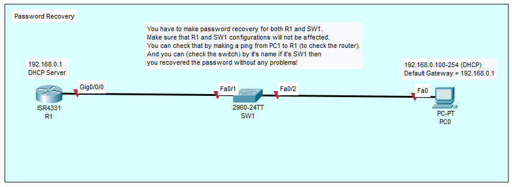
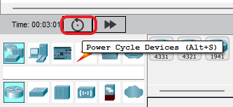
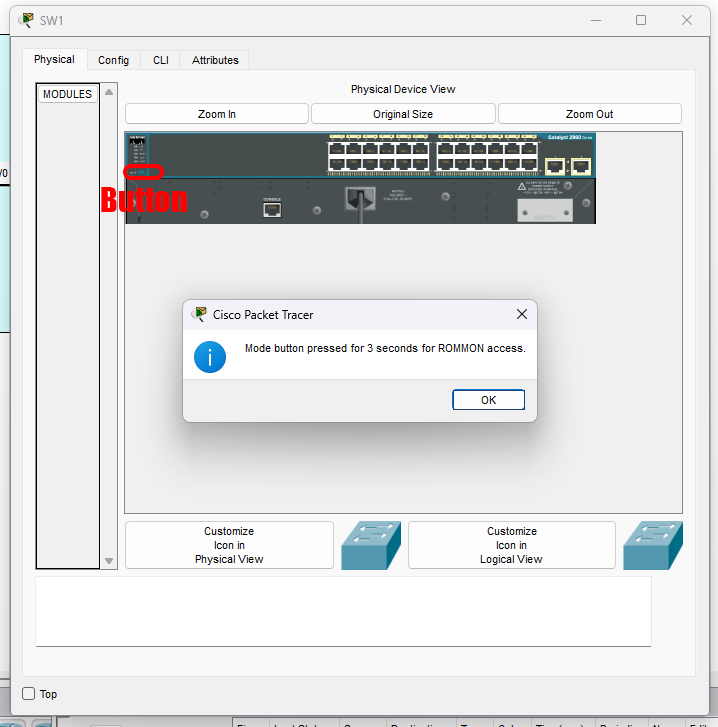

# 08 Password Recovery

## Overview
Password recovery is the emergency procedure used to regain administrative access to a Cisco IOS device when the privileged EXEC (`enable`) password or local console credentials are lost. By interrupting the standard boot process and interacting directly with the ROM Monitor (ROMMON) or the switch bootloader prompt, administrators can temporarily bypass the saved configuration, load it manually into active memory, and overwrite the unknown passwords without destroying the existing network settings.

## Why it is important
In a real-world enterprise environment, network engineers frequently inherit undocumented legacy hardware, or an administrator might leave the organization without securely handing over credentials. Instead of performing a hard factory reset on a core router—which would cause a massive network outage by wiping all complex routing protocols, interfaces, and VPN configurations—password recovery allows you to surgically replace only the forgotten credentials while leaving the rest of the critical production configuration completely intact.

## Topology


*(Topology layout based on reference: image_8eb80f.png)*

```text
      192.168.0.1/24 (DHCP Server)              192.168.0.100-254 (DHCP)
      +--------+                                +--------+
      |   R1   | Gi0/0/0      Fa0/1 +---+ Fa0/2 |  PC0   |
      |ISR 4331+--------------------+SW1+-------+        |
      +--------+                    +---+       +--------+
```
**Description:** R1 is a Cisco ISR 4331 router acting as a DHCP server with the IP address `192.168.0.1`. It connects out of interface `Gig0/0/0` into the Catalyst 2960 switch (SW1) on `FastEthernet 0/1`. PC0 is connected to SW1 on `FastEthernet 0/2` and relies on R1 to receive a dynamically assigned IP address from the `192.168.0.100-254` range. In this lab, both R1 and SW1 are currently locked out and must be booted into ROMMON mode.

## Requirements
* One Cisco ISR Router (e.g., R1 as an ISR 4331).
* One Cisco Catalyst Switch (e.g., SW1 as a 2960-24TT).
* Console cable access to both devices (SSH/Telnet cannot be used for password recovery).

**Packet Tracer Lab Note for Accessing ROMMON:**
Sometimes Cisco Packet Tracer does not save the ROMMON state correctly as the default when starting a lab. If your switch boots normally, you will need to manually interrupt the boot process:
1. Click the **Power Cycle Devices** button on the bottom toolbar.
   
2. Quickly click on the switch (SW1), navigate to the **Physical** tab, and hold down the blue **Mode** button until the prompt tells you it has been pressed long enough to enter ROMMON.
   

## Configuration

```text
! ---------------------------------------------------------
! R1 (ISR 4331 Router) Password Recovery Procedure
! ---------------------------------------------------------

! 1. Change the Configuration Register in ROMMON to ignore startup-config
rommon 1 > confreg 0x2142
rommon 2 > reset

! 2. After reboot, decline the initial configuration dialog
Would you like to enter the initial configuration dialog? [yes/no]: no

! 3. Enter Privileged EXEC mode (no password will be required)
Router> enable

! 4. CRITICAL: Copy the saved configuration from NVRAM into RAM
Router# copy startup-config running-config

! 5. Check the usernames to disable them later
Router# show run | in username  

! 6. Overwrite the lost password and old username
R1# configure terminal
R1(config)# no username admin
R1(config)# username superadmin secret P@$$w0rd

! 7. Return the Configuration Register to normal boot behavior
R1(config)# config-register 0x2102
R1(config)# end

! 8. Save the fixed configuration back to NVRAM
R1# copy running-config startup-config

! 9. Reload
R1# reload

! Note: After reloading, check the interfaces that you want to enable.


! ---------------------------------------------------------
! SW1 (Catalyst 2960 Switch) Password Recovery Procedure
! ---------------------------------------------------------

! 1. Initialize the flash file system from the switch: prompt
switch: flash_init

! 2. Rename the configuration file so the switch cannot find it during boot
switch: rename flash:config.text flash:config.old

! 3. Boot the switch
switch: boot

! 4. After reboot, decline the initial configuration dialog
Would you like to enter the initial configuration dialog? [yes/no]: no

! 5. Enter Privileged EXEC mode
Switch> enable

! 6. Rename the configuration file back to its original name
Switch# rename flash:config.old flash:config.text

! 7. CRITICAL: Load the saved configuration into active RAM
Switch# copy flash:config.text system:running-config

! 8. Overwrite the lost password and old username
SW1# configure terminal
SW1(config)# no username admin
SW1(config)# username superadmin secret P@$$w0rd
SW1(config)# end

! 9. Save the fixed configuration
SW1# copy running-config startup-config
SW1# do reload
```

## Configuration Explanation
Password recovery is fundamentally different between IOS routers and legacy fixed-configuration switches due to how they store and read configurations during the boot sequence.

**Router Explanation (The Configuration Register):**
Routers use a 16-bit hardware-level hex value in NVRAM called the **configuration register** to dictate how they boot.
* `confreg 0x2142` - The default production register is `0x2102`. Changing it to `0x2142` tells the router's bootloader to load the IOS operating system but **explicitly ignore** the `startup-config` file stored in NVRAM.
* `copy startup-config running-config` - Once the router boots into a blank configuration, this command pulls the secure, ignored production configuration from NVRAM into active RAM. This restores your hostnames, interfaces, and routing protocols, allowing you to easily remove the old `username admin` and replace it with `superadmin`.
* `config-register 0x2102` - Reverts the router to standard production behavior so it will correctly load the saved configurations on future reboots. 

**Switch Explanation (Flash File System):**
Legacy switches like the Catalyst 2960 do not use a router-style NVRAM configuration register to bypass boot configs. Instead, they store their configurations as a literal text file (`config.text`) inside flash memory.
* `flash_init` - Initializes the flash file system in ROMMON, allowing you to view and modify the raw files directly.
* `rename flash:config.text flash:config.old` - Temporarily hides the configuration file from the bootloader. When the switch reboots via the `boot` command, it thinks it is a brand new switch because it cannot find the file named `config.text`.
* `copy flash:config.text system:running-config` - Restores the previous configurations into the running RAM. Notice the syntax: on a switch, you copy from the flash directory directly into the system's running memory.

## Verification

```text
! Verification for R1
R1# show version | include register
```
* **`Configuration register is 0x2102`**: Look at the very bottom of the `show version` output. You must ensure the config-register says `0x2102` (or `0x2142 (will be 0x2102 at next reload)`). If it stays at `0x2142`, your router will wipe its running config every time it reboots!

```text
! Verification for SW1
SW1# show flash:
```
* **`config.text`**: Verify that the file `config.text` exists in flash memory and that the temporary `config.old` is no longer there.

```text
! Connectivity Check from PC0
PC0> ping 192.168.0.1
```
* If password recovery was performed successfully without destroying the original configurations, R1's `Gig0/0/0` interface will still be functioning and will reply to pings from PC0. You should also see the hostnames correctly set to `R1` and `SW1`, proving the original configurations were successfully merged.

## Common Mistakes
* **Forgetting to copy the configuration into RAM:** The most catastrophic error in a real environment. If you bypass the startup-config and immediately type `copy running-config startup-config` *before* restoring the old files into RAM, you will permanently overwrite the entire production configuration in NVRAM with a blank file. 
* **Leaving the router in 0x2142:** Forgetting the `config-register 0x2102` command. The router will work perfectly fine until the next power outage, at which point it will boot up completely blank.
* **Interface Status:** Restoring the `startup-config` on a router merges the configuration, but it often leaves physical interfaces in an administratively down state. You may need to manually issue `no shutdown` on critical interfaces like `Gig0/0/0`.

## Troubleshooting
1. **Password still not accepted:** If the new local password isn't working, check if AAA (TACACS+/RADIUS) is configured in the running-config. AAA might be forcing the device to authenticate against an unreachable remote server instead of checking the local user database.
2. **Switch file not found:** If `rename flash:config.old flash:config.text` fails, verify the exact file names using `dir flash:` in privileged EXEC mode to see exactly what you named it during the boot process.
3. **Password recovery is disabled:** In high-security environments, administrators use the `no service password-recovery` command. If you interrupt the boot sequence on a router with this configured, the device will strictly prompt you to agree to a complete factory wipe before letting you in. 

## Best Practices
* **Always verify the config-register:** Use `show version` before walking away from a router password recovery to absolutely guarantee it is set to `0x2102`.
* **Backup immediately:** After successfully recovering a device, use `copy running-config tftp:` or an equivalent method to back up the configuration immediately.
* **Secure your physical access:** Password recovery requires physical console access and rebooting the hardware. This proves that physical security *is* network security. Secure your network racks to prevent unauthorized personnel from physically manipulating devices.

## References
* [Cisco: Password Recovery Procedures](https://www.cisco.com/c/en/us/support/docs/ios-nx-os-software/ios-software-releases-121-mainline/6130-index.html)
* [Cisco: Recover Password for Catalyst Fixed Configuration Switches](https://www.cisco.com/c/en/us/support/docs/switches/catalyst-2950-series-switches/12040-pswdrec-2900xl.html)

[https://github.com/COIE-Club/cisco-ios-comprehensive-guide](https://github.com/COIE-Club/cisco-ios-comprehensive-guide)
[https://github.com/COIE-Club/cisco-ios-comprehensive-guide/issues/6](https://github.com/COIE-Club/cisco-ios-comprehensive-guide/issues/6)
