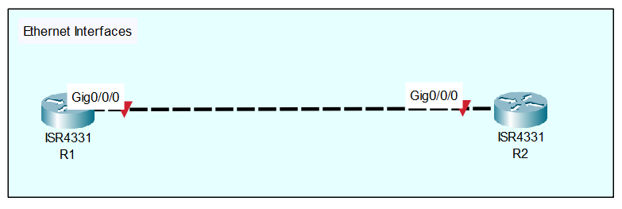

<div align="center">
  <h1>Cisco IOS Ethernet Interfaces</h1>
</div>

## Overview
Ethernet interfaces are the primary physical ports used on Cisco routers and switches to connect devices across a Local Area Network (LAN) or Wide Area Network (WAN). Configuring these interfaces with an IP address and enabling them is the very first step to allowing data to route through the network.

## Why it is important
In a production enterprise environment, a router cannot route traffic, form dynamic neighbor adjacencies, or manage packets until its physical interfaces are properly configured and brought online. Accurately labeling and addressing Ethernet interfaces forms the absolute foundation of all enterprise connectivity, ensuring that links to internet service providers (ISPs), firewalls, or core switches function correctly.

## Topology
<div align="center">
  
 *(The topology consists of two Cisco ISR4331 routers, R1 and R2, connected directly to each other via their GigabitEthernet0/0/0 interfaces. Both routers require basic IP configuration to establish Layer 3 connectivity.)*
</div>

## Requirements
* Two Cisco IOS routers (e.g., ISR4331 series).
* A direct physical or virtual Ethernet connection between `Gig0/0/0` on both devices.
* Basic terminal or console access to both devices.
* Application: Cisco Packet Tracer.

## Configuration

> **<span style="color:#e74c3c;">Important:</span>** By default, all physical interfaces on a Cisco router are in an "administratively down" state. You must manually enable them for traffic to pass.

```text
! R1 Configuration
enable
configure terminal
interface GigabitEthernet0/0/0
 description LINK_TO_R2_Gig0/0/0
 ip address 192.168.1.1 255.255.255.0
 no shutdown
 end
```

```text
! R2 Configuration
enable
configure terminal
interface GigabitEthernet0/0/0
 description LINK_TO_R1_Gig0/0/0
 ip address 192.168.1.2 255.255.255.0
 no shutdown
 end
```

## Configuration Explanation
* `interface GigabitEthernet0/0/0` - Enters interface configuration mode for the specific physical port connecting the routers.
* `description [text]` - Adds a human-readable label to the interface. While not technically required for the interface to function, this is a critical enterprise standard to quickly identify what a port connects to during troubleshooting.
* `ip address [ip] [mask]` - Assigns a Layer 3 IPv4 address and subnet mask to the interface, allowing it to route IP packets on that specific subnet.
* `no shutdown` - Administratively enables the port. This command brings the interface online to start sending and receiving electrical signals and data.

## Verification

```text
R1# show ip interface brief
R1# show interfaces GigabitEthernet0/0/0
R1# ping 192.168.1.2
```
* **`show ip interface brief`:** Verify that the `GigabitEthernet0/0/0` interface shows `up` in both the `Status` and `Protocol` columns.
* **`show interfaces GigabitEthernet0/0/0`:** Displays detailed hardware information, including the assigned MAC address, MTU, speed, and duplex settings. 
* **`ping 192.168.1.2`:** Sends ICMP echo requests from R1 to R2. A successful response (represented by `!!!!!`) confirms full Layer 3 bi-directional connectivity.

## Common Mistakes
* **Forgetting `no shutdown`:** The most common beginner mistake. You can configure the IP address perfectly, but if the port is left disabled, no traffic will flow.
* **Subnet Mask Mismatches:** Configuring mismatched subnet masks on either side of the link (e.g., `192.168.1.1 255.255.255.0` on R1 and `192.168.1.2 255.255.255.252` on R2). Both sides of a point-to-point link must share the exact same subnet mask.
* **Configuring the Wrong Interface:** Applying the configuration to `GigabitEthernet0/0/1` when the cable is physically plugged into `GigabitEthernet0/0/0`.

## Troubleshooting
1. **Layer 1 (Physical):** If `show ip interface brief` shows `down/down`, check the physical cabling or virtual link connections. The router is not detecting a signal from the remote device.
2. **Layer 2 (Data Link):** If the status shows `up/down`, check for Layer 2 issues such as speed/duplex mismatches or keepalive failures.
3. **Layer 3 (Network):** If the status is `up/up` but the `ping` command fails, verify your IP addressing. Ensure both routers are in the exact same subnet and that no typos were made in the `ip address` command.

## Best Practices
* **Always use standard descriptions:** Every interface in a production environment should have a standard description format (e.g., `[CIRCUIT_ID] - [DESTINATION_DEVICE] - [PORT]`).
* **Leave Speed/Duplex to Auto:** On modern Gigabit Ethernet links, auto-negotiation is highly reliable. Only hardcode speed and duplex settings if you are forced to connect to legacy equipment that fails to negotiate.

## References
* Cisco Command Reference: [IP Commands](https://www.cisco.com/c/en/us/td/docs/server_nw_virtual/2-5_release/command_reference/ip.html)
* Cisco Command Reference: [Chapter: Ethernet Interface Commands](https://www.cisco.com/c/en/us/td/docs/iosxr/cisco8000/Interfaces/b-interfaces-hardware-component-cr-8000/ethernet-interface-commands.html)
