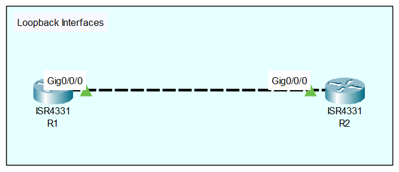

<div align="center">

  <h1>Cisco IOS Loopback Interfaces</h1>

</div>

## Overview
A loopback interface is a logical, virtual interface within a Cisco IOS router. Unlike physical interfaces (such as GigabitEthernet), a loopback interface is not tied to any physical hardware port. Because of this, it is always in an "up/up" state as long as the router is powered on, unless it is intentionally administratively shut down by an engineer.

## Why it is important
In enterprise environments, a router's physical interfaces can go down due to cable failures, switch reboots, or hardware issues. If a routing protocol or management session is tied to a physical interface IP, network access or protocol adjacencies will drop when that interface goes down. 

Network engineers use loopback interfaces to provide a highly stable, always-on IP address for:
* **Device Management:** Using the loopback IP for SSH or SNMP ensures you can always reach the router as long as at least one physical path to it exists.
* **Routing Protocol Router IDs:** OSPF and BGP use loopback interfaces for reliable Router IDs and peering addresses.
* **Simulating Networks:** They are excellent for lab environments to simulate downstream networks without needing physical switches or end devices.

## Topology
<div align="center">
  
  
  
  *(The topology consists of two Cisco ISR4331 routers, R1 and R2, connected point-to-point via their Gig0/0/0 physical interfaces. We will create virtual loopback interfaces on both devices.)*

</div>

## Requirements
* Two Cisco IOS routers (R1 and R2).
* Basic IP connectivity between the devices across the physical link.
* Access to the CLI via a terminal emulator or lab environment simulator.

## Configuration

```text
! R1 Configuration
enable
configure terminal
interface Loopback0
 description R1 Management and Router-ID
 ip address 1.1.1.1 255.255.255.255
 exit
end
write memory
```

```text
! R2 Configuration
enable
configure terminal
interface Loopback0
 description R2 Management and Router-ID
 ip address 2.2.2.2 255.255.255.255
 exit
end
write memory
```

## Configuration Explanation

| Command | Real-World Context & Explanation |
| --- | --- |
| `interface Loopback0` | Creates the logical interface (numbered 0 here, though any number up to 2147483647 can be used). The moment this command is entered, the virtual interface is created and transitions to an **up** state. |
| `description [text]` | Always label your interfaces. In production, this helps other engineers know what this specific loopback is used for (e.g., Management, BGP peering, or testing). |
| `ip address [ip] [mask]` | Assigns the IP address to the virtual interface. Notice the use of a `255.255.255.255` (`/32`) subnet mask, which creates a single host address rather than an entire subnet. |

> **Important:** You do not need to issue the `no shutdown` command on a newly created loopback interface. It comes up automatically.

## Verification

```text
R1# show ip interface brief
```

Look at the output to confirm `Loopback0` is listed and that the Status and Protocol columns both show **up**.

```text
R1# ping 1.1.1.1
```

By pinging the interface from the router itself, you verify that the IP stack is correctly responding on this virtual interface.

## Common Mistakes

* **Expecting automatic reachability from other routers:** Just because you configured a loopback on R1 does not mean R2 knows how to reach it. Because it is a virtual interface on a separate network segment, you must advertise the loopback IP via a dynamic routing protocol (like OSPF or EIGRP) or use a static route for it to be pingable from R2.
* **Wasting IP Space:** Assigning a `/24` subnet mask (e.g., `255.255.255.0`) to a loopback interface. Since loopbacks represent a single logical endpoint, doing this wastes 253 usable IP addresses.

## Troubleshooting

1. **Step 1: Check the interface status.** If you cannot reach the loopback, run `show ip interface brief` to ensure an engineer hasn't accidentally applied the `shutdown` command to it.
2. **Step 2: Verify the routing table.** If you are on R2 and cannot ping R1's loopback (`1.1.1.1`), run `show ip route` on R2. Ensure R2 actually has a route to the `1.1.1.1` network.

## Best Practices

* **Always use a /32 subnet mask** (`255.255.255.255`) for loopback interfaces meant for device management or Router IDs to conserve your organization's IP address space.
* **Standardize your numbering scheme.** For example, enterprise organizations often mandate that `Loopback0` is exclusively for the device's management IP, `Loopback1` is used for BGP peering, and `Loopback100` and above are used for temporary testing.

## References
